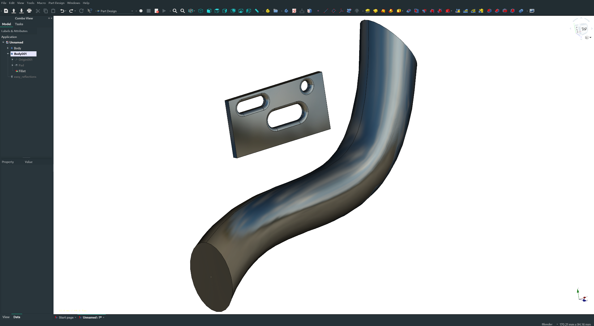

# Freecad-easy-reflections
Easy reflections in Freecad

This is the result you get in two clicks. This scripts allows you to quickly choose an environment texture you like, and apply it to every object in the current document.

# Demo

<http://arsent.ch/athanaze/easy_reflections_video.mp4>

# Installation

Put the "easy_reflections.FCMacro" file and the "easy_reflections" folder in your .FreeCAD/Macro/

# Note

Tested on linux only (Kernel: 5.4.31-1-MANJARO) but should work flawlessly on other platforms.

## Credits

All the environments textures come from <https://hdrihaven.com/> and are licensed under the CC0 license : <https://creativecommons.org/publicdomain/zero/1.0/>
